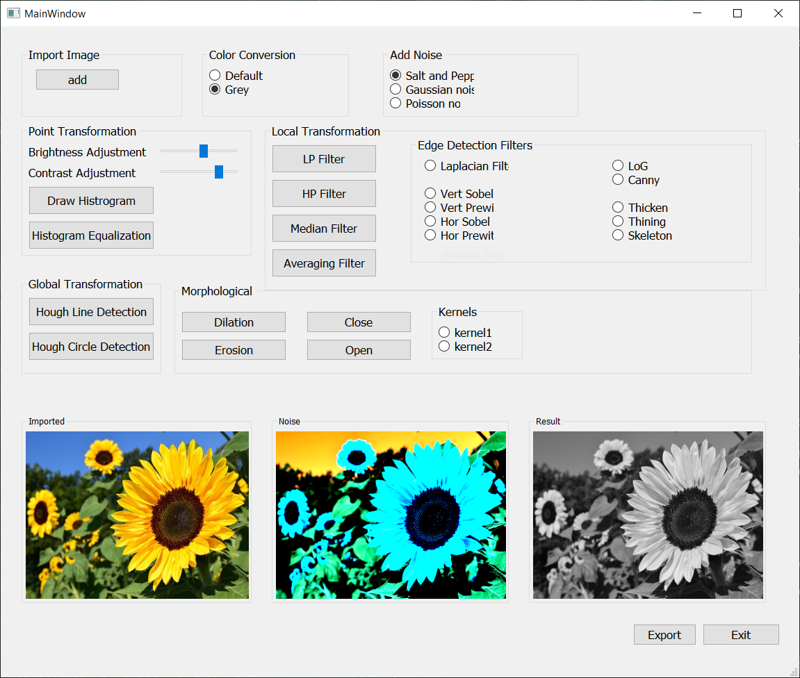
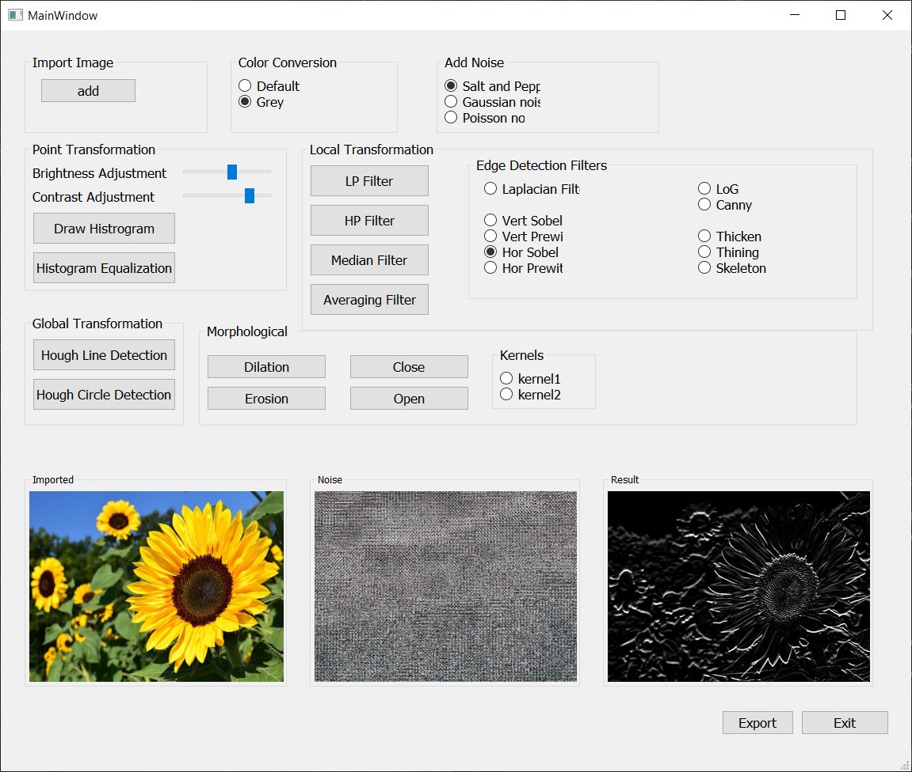
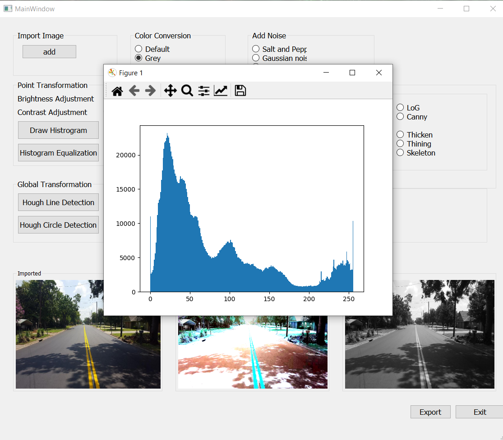
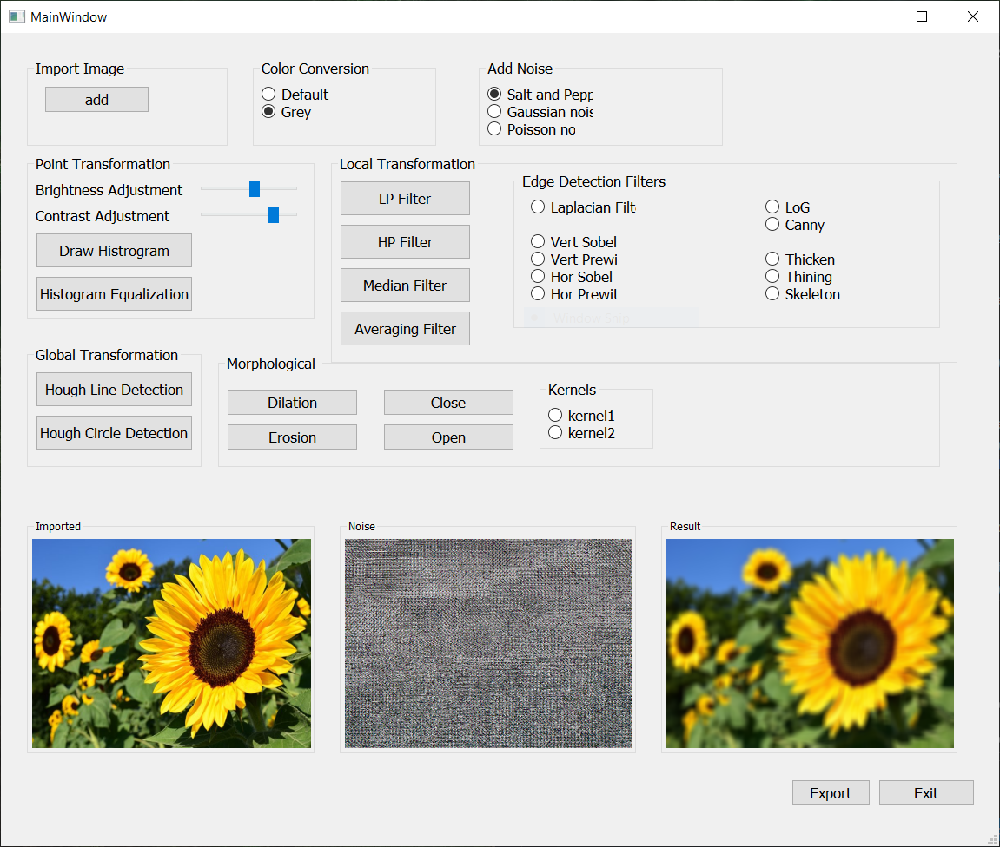
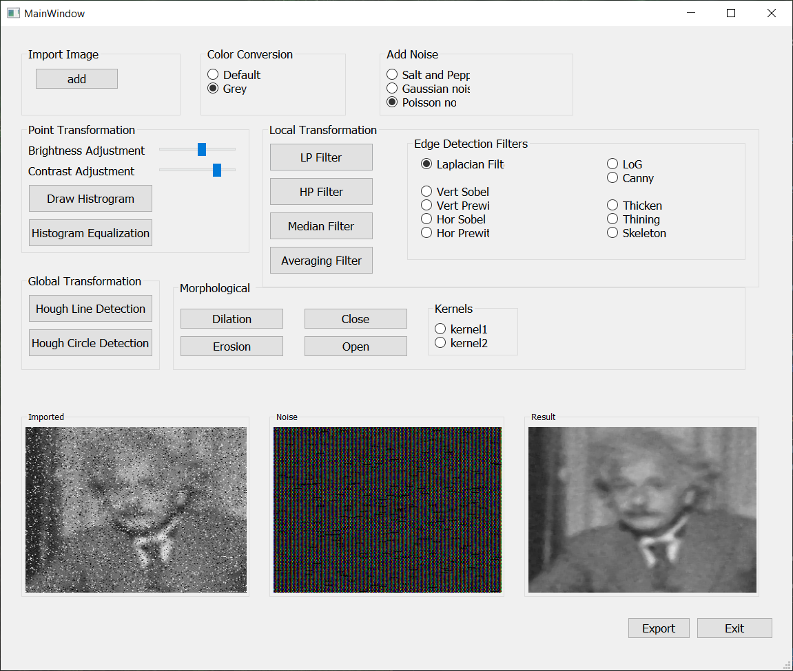
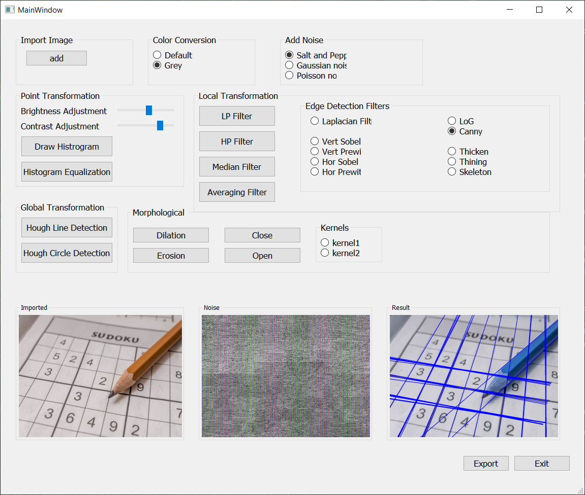

# Image TookKit

This is an Image Processing ToolKit, using PyQt for the frontend and openCV for backend.

## Installation
- Make sure to install all the requirements by : `pip install -r requirements.txt`
- Install `Qt5` for your system, for ex, I am using arch btw : [qt5](https://archlinux.org/packages/extra/x86_64/qt5-base/)
- Run `python main.py`

### Notes
- The program is only executable using the command line, you can convert it to `.exe` idk.
- If you face a problem with `Qt5` and `open-cv` : 
```
    QObject::moveToThread: Current thread (0x559f0cee5f50) is not the object's thread (0x559f0d6c5520).
    Cannot move to target thread (0x559f0cee5f50)

    qt.qpa.plugin: Could not load the Qt platform plugin "xcb" in "/home/username/.local/lib/python3.10/site-packages/cv2/qt/plugins" even though it was found.
    This application failed to start because no Qt platform plugin could be initialized. Reinstalling the application may fix this problem.

    Available platform plugins are: xcb, eglfs, linuxfb, minimal, minimalegl, offscreen, vnc, wayland-egl, wayland, wayland-xcomposite-egl, wayland-xcomposite-glx, webgl.

    zsh: IOT instruction (core dumped)  python main.py
``` 
check [this](https://stackoverflow.com/a/63839383/16787671)

## Feature List 
Those with * after either don't work, or not yet implemented.

    Process the image

        - Converting : 
            * Default colour 
            * Gray Color
        - Point Transformation : 
            * Brightness adjustments
            * Contrast adjustments
            * Showing histogram
            * Histogram Equalization
        - Local Transformation : 
            * Low pass filter
            * High pass filter
            * Median filter(grey image)
            * Averaging filter
            * Edge detection filters
                - Laplacian filter
                - Vert Prewitt
                - Zero Cross
                - Gaussian filter
                - Horiz prewitt *
                - Thicken *
                - Vert sobel
                - Laplacian of Gaussian (log)
                - Skeleton *
                - Horiz *
                - Canny method
                - Thinning *
        - Global Transformtion :   
            * Line detection using Hough Transform
            * Circle detection using Hough Transform
            * Morphological operations
            (choosing type of kernel)*
                - Dilation 
                - Erosion
    Display the image
    Save the image *

## Bugs 

- Line detection using Hough Transform might not work properly 
- Program might crash while adding noise 
- Can't save/export the image [didn't add that feature yet]
- you have to click the radio button to refresh, doesn't support automatic refresh
- Brightness and Contrast Adjustment, shows negative images. [was laze to fix]
- Thining, Thicking and Skeleton don't work. [didn't add]

## Important Notes

- This is a beta version, with a lot of code faults, need to be refactored. 
- The GUI is compact, i was busy doing the backend rather than fixing the frontend.
- This may work on linux, but i didn't test.
- You must install the requirements first.

## ScreenShots







